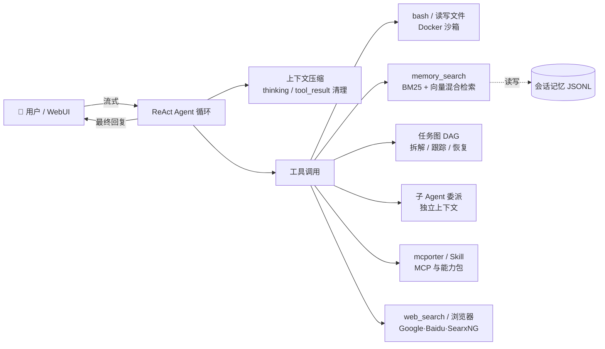

# 👻 GhostAgent · 鬼才

一个可扩展的个人 AI 助理框架——把长程记忆、Docker 沙箱、任务编排、Skill 与 MCP 扩展拧成一根能干活的 ReAct Agent。

## ✨ 特性

- **🔌 流式 ReAct 循环**　实时输出思考与工具过程，支持并行工具调用，可中途停止。
- **🧠 长程记忆 + 混合检索**　对话按会话/日期持久化（JSONL）；检索时 BM25 关键词与向量相似度双路召回，双阈值过滤，`memory_search` 主动回忆历史决策与事实。
- **📦 Docker 沙箱**　`bash` / 读写文件可逐工具配置 `sandbox` 或 `local`；容器内工作区 bind-mount 持久化，Docker 不可用时自动降级到本机执行。
- **🗂️ 任务图（DAG）编排**　长链路任务拆解为带依赖的任务图，状态持久化并随上下文压缩保留，断点可恢复。
- **🤝 子 Agent 委派**　把子任务交给拥有独立上下文与独立沙箱的子 Agent，阻塞执行后只回结论，结构上禁止递归嵌套。
- **🧩 Skill 扩展**　基于 `SKILL.md` 的能力包机制，按需 `load_skill` 加载专业知识与资源。
- **🌐 MCP 接入**　通过 [mcporter](http://mcporter.dev) CLI 直接调用任意 MCP 服务的工具，作为访问外部资源的首选通道。
- **🔍 多搜索引擎**　内置 Google / Baidu / SearxNG（自托管元搜索）三种后端可切换，附网页兜底抓取。
- **🖼️ 多模态**　支持图片上传与图像理解模型，生成结果可在对话中以 Markdown 渲染。
- **♻️ 上下文压缩**　软/硬 token 限制 + 自适应保留轮数 + LLM 摘要，自动清理过期 thinking 块与 tool_result，长对话不爆窗口。

## 🧠 工作流程



## 🚀 快速开始

### 环境要求

- Python 3.10+（项目在 3.13 上开发）
- 一个 Anthropic 兼容的 API（官方 Claude API，或兼容 Messages 接口的第三方服务）
- 【可选】Docker（用于代码执行沙箱）
- 【可选】Node.js（用于安装 `mcporter` 接入 MCP）

### 安装

```bash
git clone <your-repo-url> ghostagent
cd ghostagent

# 推荐用虚拟环境（conda / venv 均可）
python -m venv .venv && source .venv/bin/activate
pip install -r requirements.txt
```

### 必要配置

复制 `.env` 模板并填入最少三项：

| 变量 | 说明 |
| --- | --- |
| `ANTHROPIC_API_KEY` | API 密钥 |
| `ANTHROPIC_BASE_URL` | API 地址。用官方可留空；用第三方/中转服务必填 |
| `MODEL_ID` | 主对话模型 ID |

> 鬼才通过官方 `anthropic` SDK 调用，因此任何兼容 Anthropic Messages API 的服务（官方 Claude、各路中转、火山引擎 Doubao 兼容接口等）都能直接接入。

### 启动

```bash
python3 main.py
```

浏览器打开 **http://127.0.0.1:7860/** 即可开始对话。

## ⚙️ 配置参考

除上述必要项外，其余均可选；未配置时使用下方默认值。全部写在项目根目录的 `.env` 中。

### 模型与推理

| 变量 | 默认值 | 说明 |
| --- | --- | --- |
| `SUMMARY_MODEL` | 同 `MODEL_ID` | 上下文压缩时生成摘要的模型 |
| `IMAGE_MODEL_ID` | — | 图片理解模型；不配则不支持图像理解 |
| `LLM_THINKING_TYPE` | `disabled` | 思考模式：`enabled` / `disabled` / `adaptive` |
| `budget_tokens` | `4096` | thinking 预算 token 数 |
| `PARALLEL_TOOL_CALLS` | — | `true` 开启只读工具并行执行 |
| `LLM_MAX_WINDOW` | — | 模型上下文窗口大小（token） |

### 上下文压缩

| 变量 | 默认值 | 说明 |
| --- | --- | --- |
| `INIT_RECENT_ROUNDS` | — | 初始化时从记忆加载的对话轮数 |
| `KEEP_RECENT_ROUNDS` | — | 压缩后保留的最近完整对话轮数 |
| `TOKEN_RATIO_AFTER_COMPACT` | `0.3` | 压缩后 token 占窗口的比例上限 |
| `TOOL_RESULT_COMPACT_ROUNDS` | `5` | N 轮之前的 tool_result 被压缩 |
| `THINKING_REMOVE_ROUNDS` | `3` | N 轮之前的 thinking 块被删除 |

### 记忆检索

| 变量 | 默认值 | 说明 |
| --- | --- | --- |
| `EMBEDDING_MODEL` | `sentence-transformers/all-MiniLM-L6-v2` | 向量嵌入模型；中文场景推荐 `BAAI/bge-small-zh-v1.5` |
| `EMBEDDING_FORCE_CPU` | — | 强制 CPU 推理（MacBook 建议开启） |
| `MODEL_CACHE_DIR` | — | 嵌入模型本地缓存目录 |
| `MEMORY_TOP_K` | — | 检索返回的相关记忆条数 |
| `MEMORY_VECTOR_THRESHOLD` | — | 向量相似度阈值 |
| `MEMORY_BM25_THRESHOLD` | `0.5` | BM25 分数阈值 |
| `MEMORY_INDEX_ROLES` | 全部 | 建索引用的角色（逗号分隔：`user,assistant`） |
| `MEMORY_DIR` | `memory` | 会话记忆持久化目录，结构 `memory/{session_id}/{YYYY-MM-DD}.jsonl` |

### Skill

| 变量 | 默认值 | 说明 |
| --- | --- | --- |
| `SKILL_PATH` | `skills` | Skill 能力包目录，每个子目录含 `SKILL.md` |

### 浏览器与搜索

| 变量 | 默认值 | 说明 |
| --- | --- | --- |
| `web_search_engine` | — | 搜索引擎：`google` / `baidu` / `searxng` |
| `searxng_url` | `http://localhost:8182` | SearxNG 服务地址（仅 `searxng` 模式） |
| `searxng_timeout` | — | SearxNG 请求超时（秒） |
| `searxng_engines` | `google,bing,duckduckgo,baidu` | SearxNG 引擎列表 |
| `chrome_path` | — | Chrome 可执行路径（网页兜底抓取） |
| `chrome_debug_port` | — | Chrome 调试端口 |
| `chrome_fetch_timeout` | — | 抓取超时（秒） |

### Docker 沙箱

每个工具可独立设为 `sandbox`（Docker 容器内执行）或 `local`（本机执行）：

| 变量 | 默认值 | 说明 |
| --- | --- | --- |
| `SANDBOX_BASH` | `local` | bash 执行模式 |
| `SANDBOX_READ_FILE` | `local` | 读文件执行模式 |
| `SANDBOX_WRITE_FILE` | `local` | 写文件执行模式 |
| `SANDBOX_EDIT_FILE` | `local` | 编辑文件执行模式 |
| `SANDBOX_IMAGE` | `python:3.11-slim` | 沙箱容器镜像 |
| `SANDBOX_PERSIST_DIR` | `sandbox_data` | 文件持久化目录（挂载到容器 `/workspace`） |

### 日志

| 变量 | 默认值 | 说明 |
| --- | --- | --- |
| `LOGURU_LEVEL` | `INFO` | 日志级别 |
| `log_dir` | `logs` | 日志目录；LLM 输入输出单独记到 `llm_log_*.log` |

## 🧩 可选能力开启

### Docker 沙箱

把需要隔离的工具设为 `sandbox` 即可。沙箱镜像基于 `python:3.11-slim`，预装 `git/curl/wget/jq`，可用 `SANDBOX_IMAGE` 替换。每个会话独享容器，工作区通过 bind-mount 持久化到 `SANDBOX_PERSIST_DIR/{session_id}/`。Docker 未安装时自动降级为 `local`，不影响使用。

### SearxNG 自托管搜索

推荐用 SearxNG 获得稳定且可定制的搜索结果：

```bash
cd docker/searxng
docker compose up -d
# 验证
curl 'http://localhost:8182/search?q=test&format=json'
```

然后在 `.env` 中设 `web_search_engine=searxng`。启动 `main.py` 时会自动确认容器在运行。

### MCP 工具接入

鬼才把 MCP 作为访问外部资源的首选通道，通过 `mcporter` CLI 调用：

```bash
npm install -g mcporter        # 需 Node.js
mcporter list                  # 查看可用 MCP 服务
```

内置的 `mcporter` Skill 会指导 Agent 先 `mcporter list <server> --schema` 确认工具名再调用。配置好 MCP 服务后，Agent 会优先使用 MCP，仅在无可用服务时才回退到网页兜底抓取。

### Skill 扩展

在 `SKILL_PATH`（默认 `skills/`）下新建目录，放入 `SKILL.md` 描述能力即可被 Agent 发现并通过 `load_skill` 加载。可引用同目录下的资源文件，由 `read_skill_resource` 读取。

## 📁 项目结构

```
ghostagent/
├── app/
│   ├── llm/            # ReAct 循环、上下文压缩、记忆检索、记忆管理
│   ├── tool/           # 工具定义、任务图、子 Agent
│   ├── sandbox/        # Docker 容器管理、沙箱执行器
│   ├── skill/          # Skill 管理器
│   ├── browser/        # 搜索引擎、网页抓取、Chrome 控制
│   ├── prompts/        # System Prompt
│   └── log/            # 日志配置
├── web/                # Gradio Web 界面
├── skills/             # Skill 能力包（含内置 mcporter）
├── docker/             # 沙箱镜像、SearxNG 编排
├── memory/             # 会话记忆持久化（运行时生成）
├── sandbox_data/       # 沙箱文件持久化（运行时生成）
├── test/               # 测试
├── demo/               # 示例脚本
└── main.py             # 入口
```

## 📄 License

[Apache License 2.0](LICENSE)
